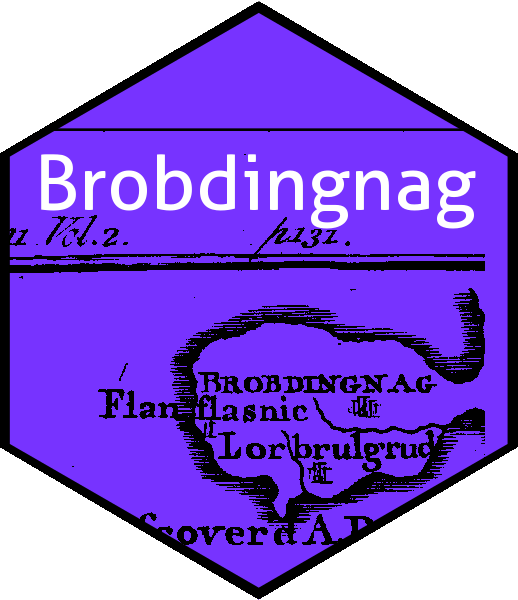

<!-- README.md is generated from README.Rmd. Please edit that file -->

```{r setup, include = FALSE}
knitr::opts_chunk$set(
  collapse = TRUE,
  comment = "#>",
  fig.path = "man/figures/README-",
  out.width = "100%"
)
```




<!-- badges: start --
[](https://cran.r-project.org/package=Brobdingnag)
<!-- badges: end -->


# Overview

The Brobdingnag package provides R-centric functionality for working
with very large numbers.  It represents a number $x$ as its logarithm
$\log\left|x\right|$ together with a logical that indicates whether
$x$ is positive.  The vignette functions as a "hello world" for S4
methods.

The package has functionality to represent Brobdingnagian matrices,
and complex numbers.


# Installation

You can install the released version of Brobdingnag from [CRAN](https://CRAN.R-project.org) with:

```{r}
# install.packages("Brobdingnag")  # uncomment this to use the package
library("Brobdingnag")
```

The package is maintained on
[github](https://github.com/RobinHankin/Brobdingnag).	

# The `Brobdingnag` package in use

Consider a googol, conventionally defined as $10^{100}$.  In standard
arithmetic we may evaluate this as follows:

```{r}
10^100
```

But a googolplex, $10^{10^{100}}$, is beyond floating-point representation:

```{r}
10^(10^100)
```

We may represent a googol straightforwardly using Brobdingnagian
arithmetic, specfically by working with `brob` objects.

```{r}
as.brob(10)
googol <- as.brob(10)^100
googol
10^googol
```

In the above, we coerce `10` to Brobdingnagian form (that is, an
object of class `brob`) using `as.brob()`.  Most arithmetic methods
work transparently with Brobdingnagian numbers:


```{r}
googol
googol + googol
googol/10
1/googol
sqrt(googol)
exp(googol)
```

Note that precision may be adversely affected for very large numbers:

```{r}
gplex <- 10^googol
gplex
gplex - gplex/10
```

The last line looks odd [the return value is package idiom for zero]
but symbolically we have $10^{10^{100}}/10=10^{10^{100}-1}\simeq
10^{10^{100}}$.  The package is vectorised and allows Brobdingnagian
arithmetic:

```{r}
googol/(1:20)
```

Signed quantities operate as expected:

```{r}
as.brob(5) - 1:10
```

It is a semi-nonobvious fact that, in addition to large numbers (that
is, $x\colon\left|x\right|\gg 1$ and small numbers
($x\colon\left|x\right|\ll 1$), the package can deal with numbers very
close to 1 (that is, $x\colon\left|x-1\right|\ll 1$).  Suppose we wish
to deal with $e^{10^{-100}}\simeq 1+10^{-100}$.  In the package:

```{r}
a <- brob(1e-100)
a
a^googol
```

The last line being numerical verification of the fact that
$\left(1+10^{-100}\right)^{10^{100}}\simeq e=2.718+$.  The package
also includes some functionality for Brobdingnagian matrices:

```{r}
brobmat(1:9,3,3)
brobmat(1:9,3,3) %*% 10^brobmat(9:1,3,3)
```
